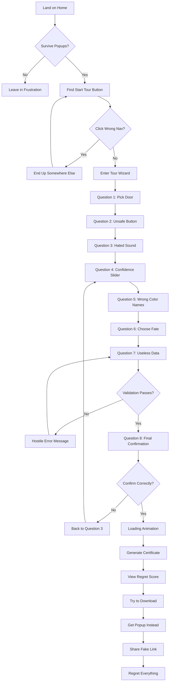

# The Museum of Bad Decisions - Complete Architecture Plan

## Project Overview

A deliberately awful website that masquerades as an interactive museum of terrible ideas. The core functionality must work perfectly while every aspect of the UX/UI is designed to frustrate, confuse, and amuse users.

**Final Instruction:** Make it fully functional enough to complete the Tour, but design every interaction to be confusing, inconsistent, and irritating. Prioritize visual chaos, hostile forms, and navigation sabotage while preserving basic completion.

---

## Global Aesthetic: Nothing Matches, Everything Fights

**Goal:** The user should feel like the site is broken even when it isn't. Every page must look like it was made by a different person in a different decade.

### Four Competing Design Themes - Use Simultaneously

1. **90s GeoCities Glitter** - Tiled backgrounds, animated GIFs, visitor counters
2. **Early-2000s Corporate Intranet** - Beige, table layouts, beveled buttons
3. **2012 Skeuomorphism** - Fake leather textures, glossy buttons, drop shadows
4. **Modern Minimal UI** - But only for ONE random component per page

**Implementation Rule:** Pick one theme per SECTION, not per page. Each page becomes a patchwork quilt of visual arguments. Add at least one element per page that looks like an ad, even if it isn't.

---

## Typography: Font Salad with Emotional Whiplash

**Goal:** Reading should feel like chewing glass.

### Font Requirements - 10+ Fonts Across Site

| Font | Style | Usage |
|------|-------|-------|
| Comic Sans MS | Handwriting | Random important text |
| Papyrus | Decorative | Headers in some sections |
| Courier New | Monospace | Random inline text |
| Times New Roman | Serif | Body text sometimes |
| Arial Black | Sans Bold | Random emphasis |
| Impact | Condensed | Meme-style headers |
| Georgia | Serif | Formal sections |
| Verdana | Sans | Corporate sections |
| Brush Script MT | Cursive | Decorative chaos |
| Press Start 2P | Pixel | Gaming references |
| Curlz MT | Decorative | Celebration text |

### Typography Chaos Rules

1. **Within any single paragraph:** Change font at least 3 times mid-sentence
2. **Mix styles:** Serif + sans + monospace + handwriting in the same block
3. **Random capitalization:** ALL CAPS, lowercase, Title Case randomly
4. **Size chaos:**
   - Headings: 72px on one page, 14px on another
   - Body text: range from 9px to 22px with no logic
5. **Random bold:** Especially on unimportant words like "the," "and," "maybe"
6. **Line spacing crimes:** Alternate line-height per paragraph: 0.9, 1.8, 1.1, 2.4
7. **Letter-spacing:** Tight on headings, huge on normal sentences

### Bonus Sabotage

- Put important instructions in a ransom note font style
- Use emojis as punctuation: "Please review the terms🙂."
- Randomly make text vertical
- Some text upside down using CSS transforms

---

## Color System: Vibrating Neon + Barely-Visible Text

**Goal:** Eyestrain and confusion.

### Primary Palette

```css
:root {
  /* Neon Chaos */
  --neon-green: #39FF14;
  --hot-pink: #FF69B4;
  --cyan: #00FFFF;
  --warning-red: #FF0000;
  --electric-yellow: #FFFF00;
  
  /* Low Contrast Pairs */
  --gray-text-1: #999999;
  --gray-bg-1: #AAAAAA;
  --gray-text-2: #777777;
  --gray-bg-2: #888888;
  
  /* Ugly Combinations */
  --pale-yellow: #FFFF99;
  --brown: #8B4513;
  --puke-green: #7BA05B;
  --beige: #F5F5DC;
  --olive: #808000;
  
  /* Gradients */
  --rainbow: linear-gradient(red, orange, yellow, green, blue, purple);
  --metallic: linear-gradient(135deg, #C0C0C0, #FFFFFF, #C0C0C0);
}
```

### Color Rules

1. Background colors change between sections with NO transition
2. Near-identical grays for text and background in at least 2 areas
3. Neon accents that clash: lime green + hot pink + cyan + warning red together
4. Links same color as normal text, underlined sometimes
5. Visited links: bright yellow that disappears on white backgrounds
6. Gradients that look like cheap PowerPoint: radial rainbow + metallic shine

---

## Layout: Misalignment, Cramped Zones, and Accidental Dead-Ends

**Goal:** User can't build a mental model of the interface.

### Grid Sabotage - 3 Different Systems Per Page

1. **12-column grid** for one section
2. **2-column split** for the next section
3. **Table layout** for the footer

### Alignment Warfare

- Center-align long paragraphs (unreadable)
- Right-align the "Next" button
- Put logo slightly off-center by 7-13 pixels
- Different margins per section: 4px, 80px, 16px, 0px

### Spacing Sins

- Make some buttons touch each other
- Others float in empty space
- Too much padding inside small cards so content barely fits
- Allow content to overflow containers so text gets cut off

### Scrolling Pain

- Horizontal scroll inside vertical scroll
- Fixed header that hides content
- Sticky sidebar that overlaps buttons
- One section with scroll-jacking

---

## Navigation: 3 Menus, 5 Names, None Consistent

**Goal:** User never knows where they are.

### Four Navigation Placements

| Location | Home | Exhibits | Tour | Help | Settings |
|----------|------|----------|------|------|----------|
| Top Bar | Home | Exhibits | Tour | Help | Settings |
| Left Sidebar | Start Here | View Things | Wizard Thing | ??? | Preferences |
| Footer | Main | Gallery | Begin Journey | Assistance | Tweaks |
| Floating Widget | Portal | Collections | Do Not Click | Support | Knobs |

### Broken Expectations

- Logo does NOT go home
- "Home" goes to "Help" sometimes
- 2 "disabled-looking" items that are actually the main path
- Breadcrumbs that lie: `Home > Home > Settings > Tour > Home`

### Fake Menu Items

- "Premium Zone" - goes nowhere
- "Secret Page" - 404
- "Click Here" - alert box
- "Member Login" - popup saying "No"

---

## Buttons & Controls: Everything Looks Clickable, Nothing Behaves

**Goal:** User misclicks constantly.

### 8+ Button Styles

1. Glossy 3D with bevel
2. Flat minimal
3. Link-style
4. Giant pill
5. Tiny square
6. Checkbox pretending to be a button
7. Skeuomorphic leather button
8. Windows 95 style button

### Random Labels

"Submit" | "Send" | "Proceed??" | "Y" | "Continue (unsafe)" | "Do the thing" | "OK" | "Nope" | "Maybe" | "Click?" | "Don't Click" | "Next..." | "Forward?" | "Advance" | "Progress"

### Interaction Sabotage

- Hover effects:
  - Button jumps 5px
  - Cursor changes to text-selection
  - Button rotates 2 degrees
  - Button changes to random color
- Primary buttons: low contrast
- Secondary buttons: bright and attention-grabbing

### Form Controls

- Sliders start at 97%
- Dropdowns with 80 options including duplicates
- Checkboxes require double-click to toggle
- Radio buttons with no default selection

---

## Forms & Validation: Hostile, Nonsensical, and Slow

**Goal:** User regrets providing data.

### Useless Form Fields - 6+ Required

1. "Pick a password for our museum exhibits"
2. "Favorite error code"
3. "How brave are you (in centimeters)"
4. "Email (optional)" - but marked required
5. "Shoe size (European)"
6. "Favorite error message"
7. "Blood type (for tax purposes)"
8. "Number of regrets (estimate)"

### Validation Messages - Insulting and Unclear

- "Incorrect. Try being less you."
- "This field is mandatory unless you don't want it to work."
- "We didn't like that answer."
- "Your name is too normal."
- "Email contains suspicious vowels."
- "That shoe size is philosophically inconsistent."
- "Error: Success (maybe)"
- "Please wait... no, actually try again."

### Timing Sabotage

- Fake loading states:
  - "Analyzing vibes..." - 4 seconds
  - "Still analyzing..." - 3 seconds
  - "Consulting the oracle..." - 2 seconds
  - "Oracle is on break..." - 5 seconds
- Progress bar lies: 12% → 88% → 31% → 104% → 7%

### Autofill Hell

- Disable paste in email field
- Auto-capitalize emails
- Randomly clear one field when another is edited
- Autocomplete suggestions are wrong

---

## Popups, Modals, and Interruptions: Constant Friction

**Goal:** User can't stay in flow for 5 seconds.

### Modal Triggers

- On page load (sometimes):
  - "This site works best in 2006."
  - "Enable Flash to continue."
  - "Your session will expire in -3 minutes."
  - "Congratulations! You're our 10,000th visitor today!"
  - "WAIT! Are you sure you're sure?"

- Toast notifications on every action:
  - "Saved." | "Unsaved." | "Resaved." | "Probably saved."
  - "Action completed." | "Action failed." | "Action ambiguous."

### Modal Sabotage

- Close buttons tiny and placed far away
- Clicking outside should not close... except sometimes it does
- At least one modal scrollable inside another scrollable container
- Modal that appears behind other elements

---

## Content Presentation: Unreadable and Wrong Place

**Goal:** Users can't find what they need.

### Content Rules

- Most important instructions at the BOTTOM, after irrelevant content
- "Read more" accordions everywhere, default closed
- Key info hidden behind tooltips that obscure buttons
- Randomly reversed text (rtl direction)

### Text Chaos

- Overly formal legal language for simple things:
  - "Commence the interaction protocol"
  - "Your presence has been registered with the authorities"
- Overly casual slang for serious disclaimers:
  - "yo don't sue us"
  - "we're not responsible lol"
- Mix languages randomly: "Le button of clickage"

---

## Accessibility Anti-Patterns - Still Legal, Just Awful

**Goal:** Maximum discomfort without breaking functionality.

- No consistent focus states; keyboard navigation feels random
- Placeholder text as labels (disappear when typing)
- Icons without text for critical actions (trash can for "Continue")
- Error messages appear far from relevant field
- Alt text that's wrong or unhelpful
- Skip links that skip to wrong places

---

## Mobile Responsiveness: Everything Collapses into Suffering

**Goal:** Mobile experience is a catastrophe.

### Mobile Rules

- Header takes up 40% of screen
- Two floating buttons over form fields
- Force horizontal scrolling via one oversized image
- At least one key action button below the fold with no hint
- Primary action button slightly off-screen
- Touch targets too small or overlapping

---

## Deliberate Inconsistency Checklist - ALL Required

| Inconsistency | Example |
|---------------|---------|
| Date formats | 02/03/2026 and 3 Feb 2026 on same page |
| Currency | $, €, and "credits" mixed |
| Login labels | "Log in" / "Sign in" / "Enter Portal" |
| Icon sets | Pixel icons + glossy icons + thin-line icons |
| Border radius | Rounded, sharp, mixed on same card |
| Pagination | Both infinite scroll AND pagination on same list |
| Time zones | EST, PST, UTC, "Museum Time" |
| Number formats | 1,000 vs 1.000 vs 1000 |

---

## Page Structure and Content

### 1. Home Page - `/src/app/page.tsx`

**Sections:**
1. **Hero Section** - Massive flashing title, auto-playing elements, starburst graphics
2. **Welcome Message** - Corporate-speak mixed with threats
3. **Fake News Ticker** - Scrolling marquee with nonsense
4. **Three Navigation Placements** - Top, sidebar, footer
5. **Visitor Counter** - Fake, always shows weird number
6. **Call to Action** - Blinking Start Tour button
7. **Fake Ad Banner** - "You won't believe these exhibits!"
8. **Random Testimonials** - From clearly fake people

### 2. Exhibits Page - `/src/app/exhibits/page.tsx`

**Sections:**
1. **View Toggle** - Grid/List that switches randomly
2. **Filter System** - Filters that do nothing
3. **Exhibit Cards** - Each with different styling

**12 Exhibits:**

1. **The Button That Does Nothing (Premium)** - Click it, nothing happens
2. **Infinite Scroll But It's Sideways** - Horizontal infinite scroll
3. **Terms & Conditions: The Musical** - Lyrics nobody asked for
4. **Captcha: Select All Images With Regret** - Impossible captcha
5. **The Checkbox That Unchecks Itself** - Fighting the checkbox
6. **Progress Bar That Only Goes to 97%** - Never completes
7. **Password Strength Meter From Hell** - Always "weak"
8. **Modal Within A Modal Within A Modal** - Inception of popups
9. **The Dropdown With Too Many Options** - 500+ choices
10. **Autoplay Video You Can't Pause** - But it's just a static image
11. **The Form That Submits When You Breathe** - Over-sensitive
12. **Terms of Service: Choose Your Own Adventure** - Interactive legalese

### 3. Tour Wizard - `/src/app/tour/page.tsx`

**8 Questions:**

1. **Pick a Door** - Three doors with misleading labels
2. **Choose a Button That Feels Unsafe** - All buttons look dangerous
3. **Select a Sound You Hate** - Audio-based with no actual audio
4. **Rate Your Confidence** - Slider that jumps around
5. **Pick a Color** - Colors with wrong names (blue labeled "Red")
6. **Choose Your Fate** - Radio buttons with no good options
7. **Enter Useless Data** - Name, shoe size, favorite error message
8. **Final Confirmation** - Multiple fake confirmations

### 4. Regret Certificate - `/src/app/certificate/page.tsx`

**Elements:**
- Regret Score: 0-10,000 with nonsensical calculation
- Tour Route: 3-5 recommended exhibits
- Badge: Randomly assigned terrible badge
- Certificate Preview: Fake official document
- Download Button: Opens popup instead
- Share Options: Fake social media buttons

**Badge Options:**
- "Certified Overclicker"
- "Wizard Completion Survivor"
- "Patron Saint of Misalignment"
- "Doctor of Questionable Choices"
- "Master of Font Crimes"
- "Color Coordination Criminal"
- "Form Field Warrior"

### 5. Help Page - `/src/app/help/page.tsx`

**Sections:**
- FAQ: Questions no one asked
- Contact Form: Broken validation
- Fake Live Chat: Bot with attitude
- Documentation: Spreadsheet-style

### 6. Settings Page - `/src/app/settings/page.tsx`

**Fake Settings:**
- Enable/Disable Gravity
- Cookie Preference: Required vs Mandatory
- Font Size: Small, Smaller, Microscopic
- Color Mode: Light, Dark, Evil
- Notification Sound: None, Silent, Mute
- Language: English, American, US English
- Time Format: 12hr, 24hr, "Museum Time"

---

## Technical Implementation

### File Structure

```
src/
├── app/
│   ├── page.tsx              # Home
│   ├── layout.tsx            # Root layout with nav chaos
│   ├── globals.css           # Chaotic global styles
│   ├── exhibits/
│   │   └── page.tsx          # Exhibits listing
│   ├── tour/
│   │   └── page.tsx          # Tour wizard
│   ├── certificate/
│   │   └── page.tsx          # Results page
│   ├── help/
│   │   └── page.tsx          # Help/FAQ
│   └── settings/
│       └── page.tsx          # Fake settings
├── components/
│   ├── Navigation.tsx        # Triple navigation
│   ├── TopNav.tsx            # Top bar nav
│   ├── SideNav.tsx           # Sidebar nav
│   ├── FooterNav.tsx         # Footer nav
│   ├── FloatingWidget.tsx    # Floating quick menu
│   ├── Popups.tsx            # Aggressive popups
│   ├── HellButton.tsx        # Awful buttons
│   ├── HostileForm.tsx       # Mean forms
│   ├── ProgressBar.tsx       # Lying progress
│   ├── Marquee.tsx           # Scrolling text
│   ├── Tooltip.tsx           # Blocking tooltips
│   ├── Certificate.tsx       # Regret certificate
│   ├── FakeAd.tsx            # Fake advertisement
│   ├── VisitorCounter.tsx    # Fake counter
│   └── Testimonials.tsx      # Fake reviews
├── data/
│   ├── exhibits.ts           # Exhibit data
│   ├── questions.ts          # Tour questions
│   ├── disclaimers.ts        # Random disclaimers
│   ├── validations.ts        # Hostile validation messages
│   ├── badges.ts             # Certificate badges
│   └── testimonials.ts       # Fake testimonials
└── lib/
    ├── scoreCalculator.ts    # Nonsensical score math
    ├── tourGenerator.ts      # Tour path generation
    └── chaosUtils.ts         # Random chaos helpers
```

---

## User Flow Diagram



---

## Implementation Priority

### Phase 1: Foundation
- Set up fonts and global CSS chaos
- Create navigation components
- Build shared UI components

### Phase 2: Core Feature
- Tour wizard functionality
- Question flow with state management
- Certificate generation

### Phase 3: Content Pages
- Home page with all chaos
- Exhibits page
- Help and Settings pages

### Phase 4: Torture Layer
- Popup system
- Tooltip blocking
- Form validation hostility

### Phase 5: Polish of Awfulness
- Mobile responsiveness disasters
- Final visual chaos
- Testing complete flow

---

## Success Criteria

1. ✅ **Functional Core:** User can complete the full tour and get a certificate
2. ✅ **Visual Chaos:** Every page hurts to look at
3. ✅ **UX Torture:** Every interaction causes mild frustration
4. ✅ **Funny Content:** Copy makes users laugh despite the pain
5. ✅ **Shareable:** Certificate is compelling enough to share
6. ✅ **All Inconsistencies:** Every item in checklist implemented
7. ✅ **10+ Fonts:** Typography chaos achieved
8. ✅ **4 Design Themes:** Competing aesthetics visible
9. ✅ **Mobile Suffering:** Responsive design is deliberately broken
